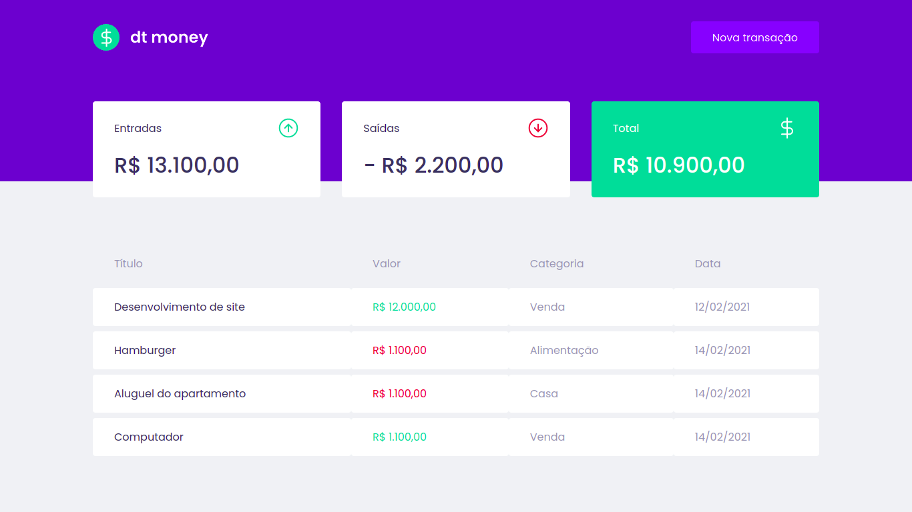
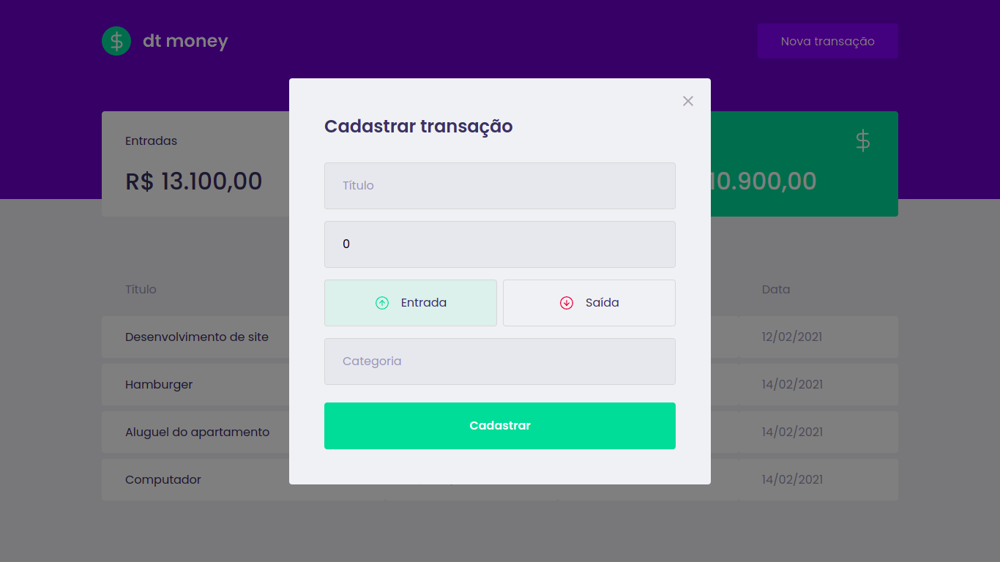

<h1 align="center">
  
</h1>

<p align="center">
  <a href="https://linkedin.com/in/leonardo-f-carvalho/"></a>
  
  <a href="https://github.com/LeonardoCD/dtmoney/commits/master"></a>
  
</p>

<!-- <p align="center">
  <a href="#-about">About the project</a> •
  <a href="#-screenshots">Screenshots</a> •
  <a href="#-layout">Layout</a> •
  <a href="#-features">Features</a> •
  <a href="#-technologies">Technologies</a> •
  <a href="#-requirements">Requirements</a> •
  <a href="#-starting">Starting</a> •
  <a href="#-license">License</a>
</p> -->

## 💻 About

This application is an personal finance manager. It was developed during the classes of Chapter II of the Rocketseat Bootcamp Ignite ReactJS track, and it is possible to register and delete transactions and see the incoming and outgoing balance 💰

## 🖼️ Screenshots

<div align="center" id="top"> 
  
</div>
<br/>
<br/>
<div align="center" id="top"> 
  
</div>

## 🔖 Layout

You can view the layout of the project through [this link](https://www.figma.com/file/0xmu9mj2TJYoIOubBFWsk5/dtmoney-Ignite-(Copy)?node-id=0%3A1). 
A [Figma](https://figma.com) account is required to access it.

##  ⚛️ Features

- List of registered finances with name, value, category and date.
- Summary cards with incomes, outcomes and total.
- Modal to register a new surety as deposit or withdraw.

## 🚀 Technologies

The following tools were used in this project:

- [React](https://pt-br.reactjs.org/)
- [TypeScript](https://www.typescriptlang.org/)
- [MirageJS](https://miragejs.com/)
- [Polished](https://polished.js.org/)
- [Axios](https://github.com/axios/axios)
- [Styled Componensts](https://styled-components.com/)

## ▶️ Starting

```bash
# Clone this project
$ git clone https://github.com/LeonardoCD/dtmoney.git

# Access
$ cd dtmoney

# Install dependencies
$ yarn

# Run the project
$ yarn start

# The server will initialize in the http://localhost:3000
```

## 📝 License

This project is under license from MIT. For more details, see the [LICENSE](LICENSE) file.

Made with 💜 by <a href="https://github.com/LeonardoCD" target="_blank">Leonardo Carvalho</a>

&#xa0;
